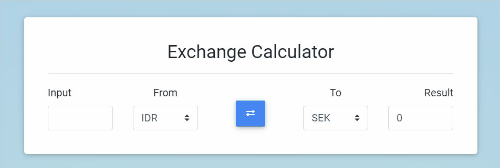

# :chart: Exchange Calculator with Vue.js

This is solutions is made by [Sebastian Porling](https://github.com/sebastian-porling).

## :100: Demo

You can view this site on [porling.me/vue-currency-converter](http://porling.me/vue-currency-converter).
I provided some GIFs :smile: that shows how the website looks and functions if you for some reason don't want to check the website or download the project!

## :interrobang: Motivation

The libraries used in this project are the following: [**AOS**](https://michalsnik.github.io/aos/) which is an animation library for "popping up" objects while scrolling, [**Material Design Bootstrap**](https://mdbootstrap.com/) for CSS, [**Axios**](https://www.npmjs.com/package/axios) for making HTTP requests,  [**Vue.js**](https://vuejs.org/) the frontend framework and [**lodash**](https://lodash.com/) which has a lot of utility functions, but only a few are used in this project.

I've added some styling in the [**style.css](./css/style.css), mostly for adding margins, sizing and background colors!

The components [**ProfileModule.js**](./components/ProfileModule.js) and [**ScrollText.js**](./components/ScrollText.js) are irrelevant for the task, but adds some "flavoring" for the project.

The component [**ExchangeCalculator.js**](./modules/ExchangeCalculator.js) is the "heaviest" of them all. It fetches data from the [Exchange Rates API](https://exchangeratesapi.io/) by getting the rates for the default rate **SEK** and also loads all the different currencies available.

In "watch" we check if the selectedFromCurrency or selectedToCurrency select lists have been changed and fetches the new rates and calculates the conversions.

In methods we have fetching methods and functions that are called by the input fields and buttons. When a input field makes the event "keyup" we will calculate a new conversion with the new value.

If the button is pressed we will switch the values in the select fields.

The `calculateInputOutout(inputFocused)` method we recieve a boolean that helps us to decide if we are going to calculate the input or output field. I use the lodash function `_.ciel(number, precision)` to truncate the floating number.

In [**ExchangeRatesList.js**](./components/ExchangeRatesList.js) I firstly fetch the API and load the table with the rates and currencies. I added a click event which changes the value of `exg`. When it is changed it will trigger the watch function and will then fetch the new currencies and rates for the new `exg` value.
